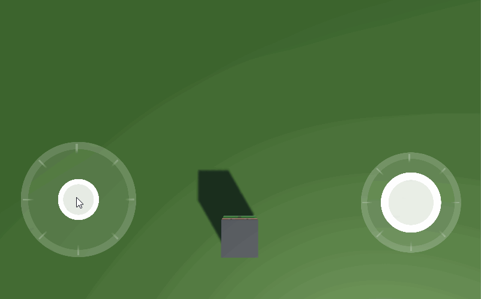
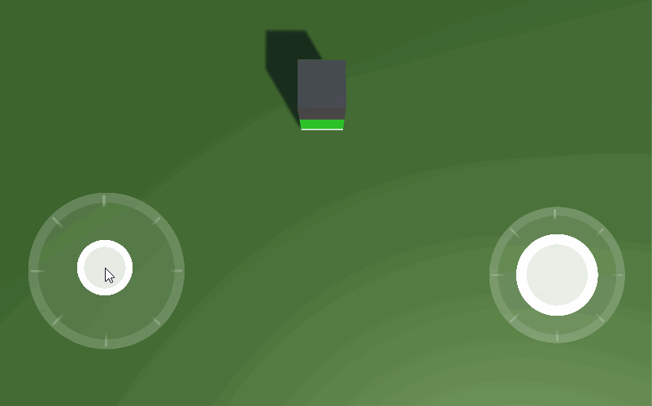
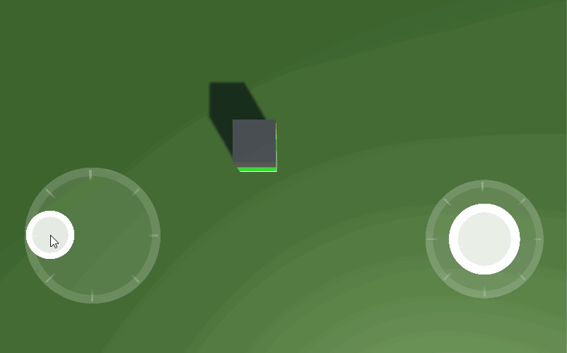
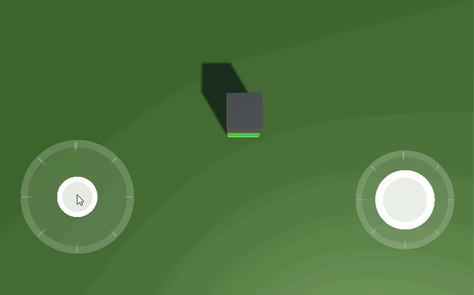
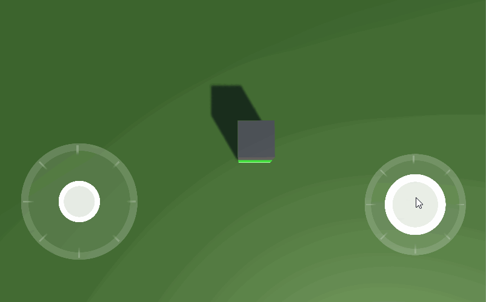

# Unity-Simple-Mobile-Joystick
Mobile Joystick suitable for any types of game
## Overview

Joystick controller for touchscreen device in unity 3d.

Similar arributes as unity native Input axis.

## Demo

<table style="width:100%">
  <tr>
    <th></th>
    <th></th>   
  </tr>
  <tr>
    <td>Moving Character Forward</td>
    <td>Moving Character Backward</td>
  </tr>
</table>

<table style="width:100%">
  <tr>
    <th></th>
    <th></th>   
  </tr>
  <tr>
    <td>Moving Character Left</td>
    <td>Moving Character Right</td>
  </tr>
</table>

<table style="width:100%">
  <tr>
    <th></th>
    <th></th>   
  </tr>
  <tr>
    <td>Rotating Character Left</td>
    <td>Rotating Character Right</td>
  </tr>
</table>

# Usages

## Parameter
  <table style="width:100%">
  <tr>
    <th>Name</th>
    <th>Description</th>   
  </tr>
  <tr>
    <td>Horizontal</td>
    <td>Stores values of horizontal movement of the stick.
    left: -1
    center: 0
    right: +1
    </td>
  </tr>
</table>

## Methods
